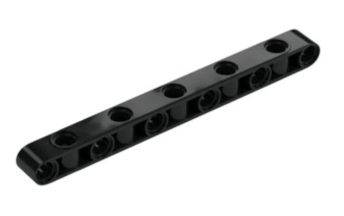
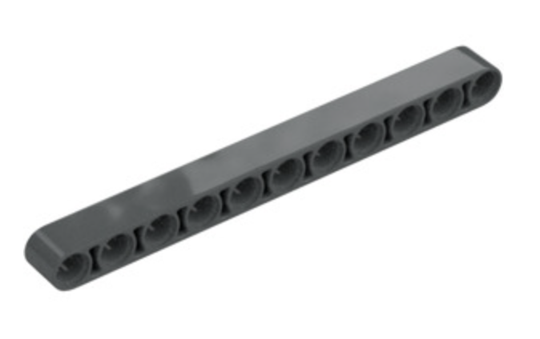

# Managing Resources

Our club has a significant collection of LEGOs for teams to use. However, with four teams sharing these resources, coaches must ensure their team is using only its fair share. In the past, we have run out of commonly-used lego pieces, such as black pins, which should never happen. For some less commonly-used pieces, when we run low, it is the coaches' responsibility to let Jeremy know so that he can order more. Please monitor your team's use of shared LEGOs, and the club's stock of LEGO, so that all teams can have a positive experience.

Each team is entitled to the following:
* Two Spike Prime hubs
* Four small motors
* Four large motors
* Four light sensors

Please do not use more than your allotted share of the above items. The above list comprises the necessary elements to build two identical robots. We typically recommend teams build two identical robots. This allows each team to program robot missiong in parallel, and it provides robustness on competition day. Sometimes a hub fails. You don't want your team to be without a functioning robot at competition!

Our club has two folding robot game tables and one flat table that must be carried by two people to the tables in the media center, and clamped to the tables to be flattened. Two of our teams' regularly-scheduled practices are on Monday/Wednesday, and two are on Tuesday/Thursday.

* Your team is only entitle to use a folding table on your regularly-scheduled practice day! If your team has extra practice scheduled on other teams' regular practice days, plan to use the flat table, leaving the folding table to the other two teams.

## Innovation project resources

Teams must decide what extra items they need to purchase to build their innovation project. Our club has sufficient financial resources that a team can spend up to $400 on their innovation project, if necessary. If your team needs to spend more, please consult with Jeremy. He may request that you seek sponsors to donate funds to help fund the club.

## Special LEGO pieces

There are certain specialized LEGO pieces that should only be used in special cases, whereas other LEGO pieces that are less expensive can be used in most other cases.

* 2-axis beams are extremely useful for changing the axis along which you're pinning LEGO. We have a handful of 2-axis beams. Kids typically do not recognize the distinction between the 2-axis beams and a standard beam, for which all holes align along the same axis. If you see your teammates using 2-axis beams when a single-axis beam will work, direct them to use the single-axis beam instead. For reference, single axis beams are about 4 cents per piece, wherease 2-axis beams cost about 20 cents per piece.

Example image of 2-axis beam: 

Example image of single-axis beam: 

* Friction-free pins are used when pinning an item that must be able to rotate freely around the axis defined by the pin. The standard black pins we have are not friction-free. The gray and yellow pins are friction free, and should only be used when rotation is desired. For all other applications, black pins should be used.
